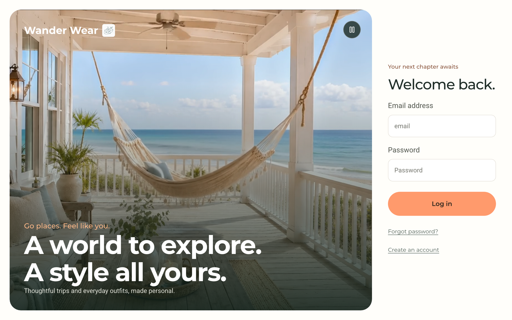

# wanderwear

Multi-agent travel planning and personal styling system, built from scratch in Python and deployed as a live product on AWS. Plans a day-by-day trip itinerary and assembles outfits from a user's own photographed wardrobe, with the two agents handing off to each other.

Live demo: https://main.d1xhj0as3larx1.amplifyapp.com



## What it does

- Trip planning. Takes a request such as "3 days in Chicago in October, flying" and returns a day-by-day itinerary with a connected map route per day, weather-aware notes, and travel times measured by a routing engine rather than guessed.
- Personal styling. Reads photos of the clothes a user actually owns and builds outfits from them slot by slot (top, layer, bottom, shoes, jewellery), including which outfits to pack for each day of a trip.
- Agent handoff. The travel agent calls the stylist agent for what to wear, the two-agent design the project was built around.
- A hard rule: outfits are assembled only from a user's uploaded wardrobe, never invented.

## Architecture

```
  Phone / laptop  (installable PWA)
        |  HTTPS
        |
  AWS Amplify ............ Next.js frontend, static export
        |  API calls
        |
  API Gateway (HTTP API) . public HTTPS front door, per-request billing
        |
        |
  VPC Link ---- Cloud Map ---- ECS Fargate task (ARM64, FastAPI)
        |                        |
        |                        |---- Supabase   (Postgres, row-level security, Auth, Storage)
        |                        |---- OpenRouter  (language and vision models)
        |                        |---- OSRM / Nominatim  (routing, geocoding)
        |
   [ a hard 30-second gateway timeout constrains the whole request ]
```

## Engineering

- Structured data isolation. Per-user row-level security with a per-request authenticated database client, an identity that raises rather than falling back to any account, every cache keyed by user id, and two-user isolation tests that run in CI on every push.
- Concurrency under a fixed timeout. Long-running plans are handed to a background job pool instead of holding a request thread; job and cache state live in Postgres so the service is stateless and scales horizontally. Designed against a 30-second gateway ceiling that cannot be raised.
- Cost-driven infrastructure. Ingress runs on an API Gateway HTTP API with a VPC link and Cloud Map service discovery, chosen over a load balancer after pricing the two options against a fixed credit runway.
- Continuous deployment with no stored keys. A push to main builds an ARM64 image, runs the full test suite inside the image, and rolls the ECS service, authenticated to AWS with short-lived GitHub OIDC tokens.
- Usage metering. Free planning is refused before the model call but counted only once a plan has finished, so an abandoned request costs nothing; a shareable restore code is enforced entirely inside the database.
- Geography-aware options. Transport choices adapt to the trip, dropping driving and train when no road route exists between origin and destination, decided from routing data rather than a hardcoded list of places.

## Stack

- Frontend: Next.js static export, Progressive Web App, AWS Amplify
- Backend: Python, FastAPI, LangGraph (the agent loop was first written by hand, then rebuilt as a LangGraph graph)
- Data: Supabase (Postgres with row-level security, Auth, signed Storage URLs)
- Models: language and vision models via OpenRouter
- Infrastructure: Docker (ARM64), Amazon ECR, ECS on Fargate, API Gateway, VPC Link, Cloud Map
- CI/CD: GitHub Actions, deploy on push, GitHub OIDC
- Routing and geocoding: OSRM, Nominatim

## Features

- Structured trip form: from, days, transport, dates, outfits yes or no
- Itinerary with a per-day map route, important notes, and measured travel times
- Outfits assembled slot by slot from a user's own wardrobe, with repeat rules so a look is not shown twice
- Add clothes by camera, categorised automatically into the right section
- Saved trips and saved outfits, and a want-to-buy shopping list from inspiration photos
- Installable on a phone home screen, with weather-aware suggestions
- A free usage tier with a clear blocker and a shareable restore code

## Source

The application code is kept private. WanderWear is a live product that handles private wardrobe photographs and travel plans, so the source is not open for reuse. This repository is a public overview of the project and its engineering.

## Goal

To build a real, defensible multi-agent product end to end, from a hand-drawn design through an agent loop written by hand and then rebuilt in LangGraph, to a secure, concurrent, self-deploying service on AWS.
